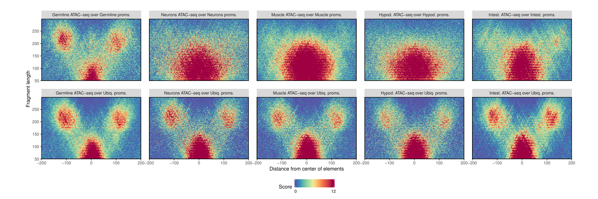

# VplotR

**VplotR is still in Alpha and has not been thorouhly tested yet.**



## Introduction

This R package makes the process of generating "V-plots" straighforward. 
V-plots have been introduced 
[for the first time](https://www.ncbi.nlm.nih.gov/pmc/articles/PMC3215028/) 
by the Henikoff lab in 2011.  

Recently, V-plots have proven to be very instructive to understand the molecular 
organization of the chromatin. For instance, the 
[nucleoATAC]((https://genome.cshlp.org/content/early/2015/08/27/gr.192294.115)) 
package relies on cross-correlation of ATAC-seq-derived V-plots to accurately map 
nucleosome occupancy along the genome.

VplotR aim is to streamline the process of generating V-plots. 
It contains wrapping functions to import paired-end sequencing bam files and 
generate V-plots around genomic loci of interest.

VplotR is designed around [ggplot2](https://ggplot2.tidyverse.org/) 
and makes full use of its potential. As such, it is easy to generate V-plots 
in batches and combine them with other plots to make publication-ready figures.

## Installation

VplotR can be ran installed from Github as follow:

```r
install.packages("devtools")
devtools::install_github("js2264/VplotR")
library(VplotR)
```

## Overview

Firstly BAM files are read using the `importPEBamFiles()` function and loci of
interest from a BED file, for instance.

```r
bam_files <- list.files(
    path = 'path/to/bam/files/', 
    pattern = '*.bam', 
    full.names = TRUE
)
granges <- rtracklayer::import('loci_of_interest.bed')
bam_list <- importPEBamFiles(
    bam_files, 
    where = GenomicRanges::resize(granges, width = 2000, fix = 'center'), 
    shift_ATAC_fragments = TRUE
)
```

*Note: to allow for a background normalization, the `where` argument should be 
omitted.*

Then V-plots of the bam files over the set of loci of interest (`granges`) 
are generated using the `plotVmat()` function:

```r
Vplot <- plotVmat(bam_list, granges)
```

The generation of multiple V-plots can be parallelized as follow:

```r
list_params <- list(
    list("bam" = bam1, "granges" = granges1), 
    list("bam" = bam2, "granges" = granges2), 
    ..., 
    list("bam" = bamN, "granges" = grangesN)
)
plots <- plotVmat(
    list_params, 
    cores = length(list_params)
) + facet_wrap(~Cond.)
```

Finally, the `nucleosomeEnrichment()` function is useful to statistically quantify 
and compare nucleosome enrichment (e.g. flanking nucleosome at promoters). To do so:

```r
nucleosomeEnrichment(
    bam_granges = bam_files[[1]], 
    granges = granges
)
```

For more details and additional functions, read the 
[Introduction vignette](vignettes/Introduction.md).

